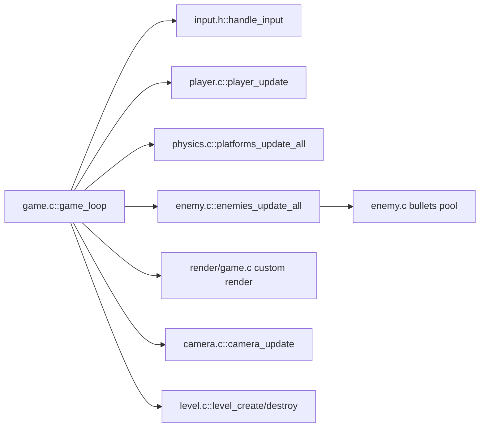

# MiniRunner

Fast 2D runner built in C + SDL2 with procedural levels and a compact game loop.


— Russian README: see [`README.ru.md`](README.ru.md)

## TL;DR
- **Procedural levels** with ground, floating and moving platforms.
- **Enemy zoo:** Patrol, Flying (kill by headbutt), Jumper, Shooter (bullets), Spike (non-stompable).
- **Crumbling platforms** with fade-out on any step trigger (even after leaving).
- **Demo mode** to quickly showcase mechanics.

## Features
- **Deterministic core loop:** input → simulation (physics, enemies, bullets, platforms) → render.
- **Difficulty ramp** via enemy mix and platform hazards.
- **Lightweight rendering** with simple shapes and colors per entity type.
- **Graceful respawn** with i-frames and camera follow.

## Architecture


- **Player**: movement, collisions with platforms; jumps; i-frames after damage.
- **Enemies**:
  - Patrol: ground walker with edge/obstacle turn.
  - Flying: horizontal patrol, sinusoidal Y, killed by headbutt.
  - Jumper: timed jumps, with edge safety and turn-back.
  - Shooter: stationary, fires periodic bullets (global pool).
  - Spike: ground hazard; stomping disabled.
- **Platforms**: ground/floating/moving; crumbling platforms fade and then vanish.

## Build

Requirements:
- SDL2 (macOS: `brew install sdl2`)

Targets:
```bash
make               # builds main executable: runner
make runner_demo   # builds demo executable: runner_demo
```

## Run
```bash
./runner
# Demo (more enemies, more crumble, higher difficulty):
./runner_demo
```

### Environment
- **START_DIFFICULTY=<int>** — initial difficulty (default: 1)
  ```bash
  START_DIFFICULTY=4 ./runner
  ```
- **DEMO_MODE=1** — increase density and guarantee variety
  ```bash
  DEMO_MODE=1 START_DIFFICULTY=5 ./runner
  ```

## Controls
- **Left/Right**: A/D or Arrow keys
- **Jump**: Space
- **Quit**: ESC

## Gameplay Notes
- **Flying** dies from headbutt (player moving upward into it).
- **Jumper** won’t leap into void; turns at unsafe edges.
- **Spike** can’t be stomped; colliding causes damage.
- **Crumbling platforms** trigger on any step and fade out before removal.

## Code Structure
```
include/
  enemy.h, platform.h, player.h, input.h, ...
src/
  game.c        # main loop, render, collisions with enemies/bullets
  player.c      # player physics and platform collisions
  enemy.c       # enemies AI + bullets pool
  level.c       # procedural generation (DEMOMODE tweaks)
  physics.c     # platform updates (crumble timers, moving)
  camera.c, render.c, input.c, ...
Makefile        # runner / runner_demo
```

## Design Decisions
- **Simple AABB collisions** for clarity and performance.
- **Global bullet pool** for Shooters — minimal overhead, cache-friendly.
- **Fade-out via alpha** with `SDL_BLENDMODE_BLEND` (no textures needed).
- **Environment-driven configs** (`START_DIFFICULTY`, `DEMO_MODE`) for quick experimentation.

## Performance
- Fixed-step normalization `dt≈1` at 60 FPS; clamped for spikes/lag.
- Minimal allocations during frame; enemies allocated per level only.

## Troubleshooting
- SDL2 not found on macOS:
  ```bash
  brew install sdl2
  # If necessary, ensure sdl2-config is in PATH
  ```
- Window opens but you don’t see variety: use demo:
  ```bash
  DEMO_MODE=1 START_DIFFICULTY=5 ./runner
  ```
- Excessive difficulty: lower `START_DIFFICULTY` or unset `DEMO_MODE`.

## Roadmap
- Textures and sprite animations.
- Sound effects.
- Deterministic seed for reproducible runs.
- More hazards (moving spikes, falling icicles), coins and scoring.
- Basic CI (GitHub Actions) to build on macOS.

## Contributing
- Open an issue or PR. Keep functions focused and small.
- Style: C89/C99 compatible, no mid-file includes; headers in `include/`.
- Please run `make` and test both `runner` and `runner_demo` before submitting.

## License
PolyForm Strict 1.0.0 — see [LICENSE](LICENSE) or the official text at
https://polyformproject.org/licenses/strict/1.0.0/
