# MiniRunner

Аркадный 2D раннер на C + SDL2 с процедурной генерацией и компактным игровым циклом.


— English README: см. [`README.md`](README.md)

## TL;DR
- **Процедурные уровни**: земля, парящие и подвижные платформы.
- **Зоопарк врагов**: Patrol, Flying (убивается «ударом головой»), Jumper, Shooter (пули), Spike (нельзя стомпить).
- **Разрушаемые платформы** с альфа‑фейдом при любом шаге по ним (даже если уже ушли).
- **DEMO‑режим** для быстрой демонстрации механик.

## Фичи
- **Детерминированный цикл**: ввод → симуляция (физика, враги, пули, платформы) → рендер.
- **Рост сложности** за счёт смеси врагов и ловушек.
- **Лёгкий рендер**: простые фигуры и цвета по типам.
- **Мягкий респаун**: i‑frames, корректная камера.

## Архитектура

```mermaid
flowchart LR
  A[game.c::game_loop] --> B[input.h::handle_input]
  A --> C[player.c::player_update]
  A --> D[physics.c::platforms_update_all]
  A --> E[enemy.c::enemies_update_all]
  E --> E2[enemy.c пул пуль]
  A --> F[render / кастомный рендер в game.c]
  A --> G[camera.c::camera_update]
  A --> H[level.c::level_create/destroy]
```


- **Player**: движение, коллизии с платформами, прыжок, i‑frames.
- **Enemies**:
  - Patrol: ходит по земле, разворачивается от края/препятствия.
  - Flying: патруль по X, синус по Y; убивается «головой» (удар снизу).
  - Jumper: прыжки по таймеру; не прыгает в пропасть (проверка опоры/краёв).
  - Shooter: стоит, периодически стреляет (глобальный пул пуль).
  - Spike: «шипы»; стомп отключён (всегда урон при контакте).
- **Platforms**: ground/floating/moving; `PLATFORM_CRUMBLE` — таймер и плавное исчезновение.

## Сборка

Зависимости:
- SDL2 (macOS: `brew install sdl2`)

Цели сборки:
```bash
make               # основной: runner
make runner_demo   # демо: runner_demo
```

## Запуск
```bash
./runner
# Демо (больше врагов, больше crumble, выше сложность):
./runner_demo
```

### Переменные окружения
- **START_DIFFICULTY=<int>** — стартовая сложность (по умолчанию 1)
  ```bash
  START_DIFFICULTY=4 ./runner
  ```
- **DEMO_MODE=1** — поднять плотность и гарантировать разнообразие типов
  ```bash
  DEMO_MODE=1 START_DIFFICULTY=5 ./runner
  ```

## Управление
- **Влево/Вправо**: A/D или стрелки
- **Прыжок**: Пробел
- **Выход**: ESC

## Геймплей
- **Flying**: убивается «ударом головой» (игрок движется вверх и задевает снизу).
- **Jumper**: не выпрыгивает в пустоту; разворачивается у края.
- **Spike**: по нему нельзя стомпить; при контакте — урон.
- **Crumble**: платформа начинает исчезать при любом шаге по ней; виден альфа‑фейд.

## Структура кода
```
include/
  enemy.h, platform.h, player.h, input.h, ...
src/
  game.c        # главный цикл, рендер, коллизии с врагами/пулями
  player.c      # физика игрока и коллизии с платформами
  enemy.c       # AI врагов + пул пуль для Shooter
  level.c       # процедурная генерация (усиления в DEMO_MODE)
  physics.c     # апдейты платформ (таймеры крушения, движение)
  camera.c, render.c, input.c, ...
Makefile        # цели: runner / runner_demo
```

## Дизайн‑решения
- **AABB‑коллизии**: просто и прозрачно.
- **Глобальный пул пуль**: минимум оверхеда, кэш‑дружелюбно.
- **Альфа‑фейд** через `SDL_BLENDMODE_BLEND` — без текстур.
- **Параметры через окружение** (`START_DIFFICULTY`, `DEMO_MODE`) для быстрых экспериментов.

## Производительность
- Нормализация `dt≈1` при 60 FPS, защита от лагов.
- Аллокации — вне кадра (враги — при создании уровня).

## Проблемы и решения
- Не находится SDL2 на macOS:
  ```bash
  brew install sdl2
  # при необходимости проверьте, что sdl2-config в PATH
  ```
- Открылось окно, но мало разнообразия:
  ```bash
  DEMO_MODE=1 START_DIFFICULTY=5 ./runner
  ```
- Слишком сложно: понизьте `START_DIFFICULTY` или уберите `DEMO_MODE`.

## Roadmap
- Текстуры и спрайтовая анимация.
- Звуковые эффекты.
- Дет‑сид для повторяемых прогонов.
- Новые ловушки (движущиеся шипы, падающие сосульки), монеты и очки.
- CI (GitHub Actions) для сборки на macOS.

## Contributing
- Issues/PR приветствуются. Небольшие, сфокусированные изменения.
- Стиль: C89/C99, без include посреди файла; заголовки в `include/`.
- Перед PR: `make` и проверка `runner` и `runner_demo`.

## Лицензия
MIT — см. [LICENSE](LICENSE).
